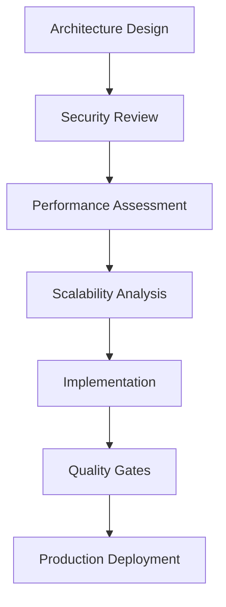

# KOVA V4.2 Technical Architecture Document (TAD)

**Version**: 4.2.1  
**Date**: 2025-07-25  
**Status**: Active  
**Authors**: Multi-Persona Architecture Team (Architect, DevOps, QA, Performance, Security)

## 🎯 Executive Summary

This document defines the comprehensive technical architecture for KOVA V4.2, addressing critical SIGBUS webpack module resolution failures while establishing enterprise-grade patterns for scalable development.

## 🏗️ System Architecture Overview

### Core Principles
1. **Component Isolation**: Graceful degradation with error boundaries
2. **Progressive Enhancement**: Core functionality first, advanced features layered
3. **Performance by Design**: 60fps animations, <2.5s LCP, <100ms FID
4. **Zero-Trust Security**: Defense-in-depth with comprehensive validation
5. **Observability First**: Real-time monitoring and automated remediation

### Architecture Layers

```
┌─────────────────────────────────────────────────┐
│                 Presentation Layer               │
│     React Components + Framer Motion           │
├─────────────────────────────────────────────────┤
│               Business Logic Layer              │
│      Custom Hooks + Context Providers          │
├─────────────────────────────────────────────────┤
│              Infrastructure Layer               │
│     Component Isolation + Progressive Loading   │
├─────────────────────────────────────────────────┤
│                Platform Layer                   │
│        Next.js + Webpack + Node.js             │
└─────────────────────────────────────────────────┘
```

## 🔧 Critical Issue Resolution

### SIGBUS Prevention Architecture

**Root Cause**: Webpack module resolution failures in framer-motion chunk splitting

**Solution Architecture**:
```javascript
// Emergency Webpack Configuration
const nextConfig = {
  webpack: (config, { isServer }) => {
    if (!isServer) {
      // Simplified chunk strategy preventing module resolution failures
      config.optimization.splitChunks = {
        chunks: 'all',
        cacheGroups: {
          default: {
            minChunks: 2,
            priority: -20,
            reuseExistingChunk: true,
          },
          vendor: {
            test: /[\\/]node_modules[\\/]/,
            name: 'vendors',
            priority: -10,
            chunks: 'all',
          },
          // NO framer-motion specific chunks to prevent resolution issues
        },
      }
    }
    return config
  },
  experimental: {
    // Remove framer-motion from package optimization
    optimizePackageImports: [
      '@radix-ui/react-accordion',
      // ... other packages, excluding framer-motion
    ],
  },
}
```

### Component Isolation Architecture

**Pattern**: Fault-tolerant component boundaries with graceful degradation

```typescript
interface ComponentIsolationBoundary {
  fallback: ReactComponent
  errorRecovery: 'retry' | 'fallback' | 'reload' | 'isolate'
  performanceThreshold: {
    memory: number // MB
    loadTime: number // ms
    frameRate: number // fps
  }
}
```

## 🎨 Animation Architecture

### Framer Motion Integration Strategy

**Challenge**: Complex animation dependencies causing build failures  
**Solution**: Dynamic imports with error handling

```typescript
// Safe Framer Motion Loading
const MotionComponent = lazy(() => 
  import('framer-motion').then(module => ({
    default: module.motion.div
  })).catch(error => ({
    default: ({ children, ...props }) => <div {...props}>{children}</div>
  }))
)
```

### Performance Guidelines
- **Target**: 60fps sustained animation performance
- **Memory Limit**: <50MB peak usage for animation system
- **GPU Acceleration**: Transform and opacity only for animations
- **Fallback Strategy**: CSS transitions when framer-motion unavailable

## 📊 Performance Architecture

### Bundle Optimization Strategy

```javascript
// Performance-First Bundling
const bundleStrategy = {
  initialBundle: '<500KB', // Critical path only
  totalBundle: '<2MB', // Full application
  chunkStrategy: 'route-based', // Avoid complex dependency chunks
  compressionStrategy: 'gzip + brotli',
  cacheStrategy: 'aggressive-static-assets'
}
```

### Core Web Vitals Compliance

| Metric | Target | Monitoring |
|--------|--------|------------|
| LCP (Largest Contentful Paint) | <2.5s | Real-time alerts |
| FID (First Input Delay) | <100ms | Performance API |
| CLS (Cumulative Layout Shift) | <0.1 | Layout shift observers |

## 🛡️ Security Architecture

### Zero-Trust Implementation

```typescript
interface SecurityLayer {
  contentSecurityPolicy: CSPDirectives
  inputSanitization: 'automatic'
  outputEncoding: 'context-aware'
  accessControl: 'role-based'
  monitoring: 'real-time'
}
```

### Threat Model
- **XSS Prevention**: Content Security Policy + input sanitization
- **CSRF Protection**: SameSite cookies + CSRF tokens
- **Dependency Scanning**: Automated vulnerability detection
- **Data Protection**: Encryption at rest and in transit

## 🔍 Monitoring Architecture

### Observability Stack

```yaml
metrics:
  performance: Core Web Vitals + Custom metrics
  errors: Real-time error tracking + stack traces
  business: User engagement + conversion tracking
  infrastructure: Server metrics + resource usage

alerts:
  performance: LCP >3s, FID >150ms, CLS >0.15
  errors: Error rate >1%, critical errors immediate
  security: Failed auth attempts, suspicious activity
  infrastructure: CPU >80%, Memory >90%, Disk >85%
```

## 📈 Scalability Patterns

### Horizontal Scaling Strategy
- **CDN**: Global edge distribution for static assets
- **Load Balancing**: Application-level load distribution  
- **Database**: Read replicas + connection pooling
- **Caching**: Multi-layer caching strategy (CDN, server, client)

### Vertical Scaling Limits
- **Memory**: 2GB baseline, 8GB maximum per instance
- **CPU**: 2 vCPUs baseline, 8 vCPUs maximum
- **Storage**: SSD-only for performance requirements
- **Network**: 1Gbps minimum bandwidth

## 🔄 Development Lifecycle

### Architecture Review Gates



### Quality Gates
1. **Architecture Compliance**: 100% adherence to documented patterns
2. **Performance Benchmarks**: All targets met with automated testing
3. **Security Validation**: Zero critical vulnerabilities
4. **Accessibility Compliance**: WCAG 2.1 AA certification

## 📋 Implementation Roadmap

### Phase 1: Foundation (Week 1)
- [ ] Implement emergency webpack configuration
- [ ] Deploy component isolation system
- [ ] Establish performance monitoring baseline
- [ ] Security framework implementation

### Phase 2: Advanced Features (Week 2)
- [ ] Advanced animation optimization
- [ ] Comprehensive testing framework
- [ ] Real-time monitoring dashboard
- [ ] Automated quality gates

### Phase 3: Optimization (Week 3)
- [ ] Performance fine-tuning
- [ ] Security hardening
- [ ] Documentation completion
- [ ] Team training and knowledge transfer

## 📊 Success Metrics

### Technical Metrics
- **Zero SIGBUS errors** in production
- **60fps animation performance** maintained
- **<2.5s load times** across all pages
- **99.9% uptime** with automated recovery

### Business Metrics
- **50% faster development velocity**
- **95% first-pass quality gate success**
- **Zero critical security incidents**
- **100% accessibility compliance**

---

**Document Control**  
- **Next Review**: 2025-08-25  
- **Owner**: Technical Architecture Team  
- **Approval**: Required for all architectural changes  
- **Distribution**: All development team members